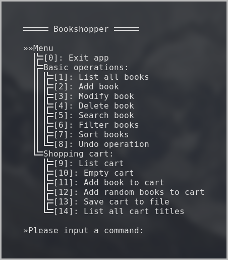

<h1 align="center"> 
	 
	 
	 Bookshopper application 
</h1>

## Table of Contents

- [Details](#details)
- [Get the app](#get-the-app)
	- [Downloading](#-downloading-)
	- [Installing](#-installing-)
	- [Running](#-running-)
- [Usage](#usage)

## Details

A bookshop management application.

The app is meant to help bookshop owners manage their books better and help clients manage their shopping carts, to keep track of the books taken for rental.

It allows storing of information about books in the shop, helps manage them and acts like a small database manager for books.

__Notes__: For now, only a _Command-Line Interface_ (CLI) is available for the app.

## Get the app

__Note__: for now, only the linux version of the app is supported, though it should run an all Unix-like operating systems.

<h4 align="center"> Downloading: </h4>

__Linux__: To download the app, got to the [release page](https://github.com/adipopbv/bookshopper/releases) and select the wanted version for downloading ([latest](https://github.com/adipopbv/bookshopper/releases/latest) version is recomended).

<h4 align="center"> Installing: </h4>

__Linux__: No installation is required. Just move the downloaded binary file wherever you like (recomended to ~/.local/bin for a 'this user' only install).

<h4 align="center"> Running: </h4>

__Linux__: 
* If the install location is in the <code>$PATH</code> variable, you can run the app by typing <code>bookshopper</code> in a command-line environment like a terminal emulator or a tty.
* If the install location is not in the <code>$PATH</code> variable, you need to provide the relative (or absolute) path to the binary file in the command-line environment of your choice.

## Usage

The app displays a menu after each operation, presenting all posible operations.

To select an operation, type the command number indicating the wanted operation and press <code>Enter</code> or <code>Return</code>.

A book has some fields: _title_, _author_, _genre_, _release year_ and is uniqely identified by _**title**_ and _**author**_. Within the app you can do the following operations:
> 1. Display the full list of books

> 2. Basic operations:
>    * Add book
>    * Modify book
>    * Delete book

> 3. Search book (by any fields)

> 4. Filter books by:
>    * Title
>    * Release year

> 5. Sort books by:
>    * Title
>    * Author
>    * Release year and genre

> 6. Undo add/modify/delete book operations

> 7. Shopping cart operations:
>    * List books in cart
>    * Empty the shopping cart
>    * Add book to cart (by title)
>    * Add random books to cart
>    * Export cart as CVS
>    * List titles

A more elaborate manual will be added to the [wiki](https://github.com/adipopbv/bookshopper/wiki) if decided necessary.
